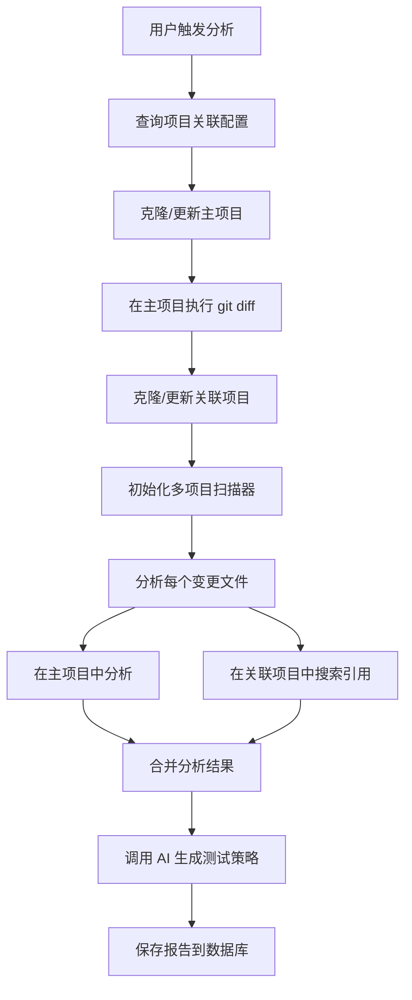

# 跨项目影响分析实施方案（方案 A）

## 📋 文档概述

**项目名称**：代码变更影响分析系统 - 跨项目支持  
**方案版本**：A - 多项目配置方案  
**创建日期**：2024-12-18  
**适用场景**：微服务架构下的跨项目代码变更影响分析

---

## 🎯 方案目标

### 当前系统限制
- ✗ 只能分析单个 Git 仓库
- ✗ 无法检测跨项目的 API 调用
- ✗ 无法发现其他项目对变更代码的依赖

### 方案 A 目标
- ✅ 支持配置多个关联项目
- ✅ 自动检测跨项目的类引用和 API 调用
- ✅ 生成包含跨项目影响的完整报告
- ✅ 保持各项目独立的 Git 仓库结构

---

## 🏗️ 架构设计

### 核心思想

```
主项目（beehive-order-finance）
  ↓ 执行 git diff
  ↓ 获取变更文件列表
  ↓
扫描范围 = 主项目 + 所有关联项目
  ↓ 静态分析 + API 追踪
  ↓
生成跨项目影响报告
```

### 工作流程



---

## 📊 数据库设计

### 1. 新增表：project_relation

**用途**：存储项目之间的关联关系

```sql
CREATE TABLE `project_relation` (
  `id` INT AUTO_INCREMENT PRIMARY KEY,
  `main_project_name` VARCHAR(255) NOT NULL COMMENT '主项目名称',
  `main_project_git_url` VARCHAR(500) NOT NULL COMMENT '主项目Git地址',
  `related_project_name` VARCHAR(255) NOT NULL COMMENT '关联项目名称',
  `related_project_git_url` VARCHAR(500) NOT NULL COMMENT '关联项目Git地址',
  `related_project_branch` VARCHAR(100) DEFAULT 'master' COMMENT '关联项目分支',
  `is_active` TINYINT(1) DEFAULT 1 COMMENT '是否启用',
  `created_at` DATETIME DEFAULT CURRENT_TIMESTAMP,
  `updated_at` DATETIME DEFAULT CURRENT_TIMESTAMP ON UPDATE CURRENT_TIMESTAMP,
  UNIQUE KEY `uk_main_related` (`main_project_git_url`, `related_project_git_url`)
) ENGINE=InnoDB DEFAULT CHARSET=utf8mb4 COMMENT='项目关联关系表';
```

**示例数据**：
```sql
INSERT INTO project_relation (main_project_name, main_project_git_url, related_project_name, related_project_git_url) VALUES
('beehive-order-finance', 'git@git.hrlyit.com:beehive/beehive-order-finance.git', 
 'beehive-order-finance-frontend', 'git@git.hrlyit.com:beehive/beehive-order-finance-frontend.git'),
('beehive-order-finance', 'git@git.hrlyit.com:beehive/beehive-order-finance.git',
 'beehive-order-scfPc', 'git@git.hrlyit.com:beehive/beehive-order-scfPc.git');
```

### 2. 修改表：analysis_report

**新增字段**：
```sql
ALTER TABLE analysis_report 
ADD COLUMN `source_project` VARCHAR(255) DEFAULT 'main' COMMENT '来源项目（main/关联项目名）';
```


---

## 💻 后端实现

### Phase 1：数据模型层

#### 1.1 创建 ProjectRelation 模型

**文件**：`code_diff_project/backend/analyzer/models.py`

```python
class ProjectRelation(models.Model):
    """项目关联关系配置"""
    main_project_name = models.CharField(max_length=255, verbose_name="主项目名称")
    main_project_git_url = models.CharField(max_length=500, verbose_name="主项目Git地址")
    related_project_name = models.CharField(max_length=255, verbose_name="关联项目名称")
    related_project_git_url = models.CharField(max_length=500, verbose_name="关联项目Git地址")
    related_project_branch = models.CharField(max_length=100, default='master', verbose_name="关联项目分支")
    is_active = models.BooleanField(default=True, verbose_name="是否启用")
    created_at = models.DateTimeField(auto_now_add=True, verbose_name="创建时间")
    updated_at = models.DateTimeField(auto_now=True, verbose_name="更新时间")

    class Meta:
        db_table = 'project_relation'
        unique_together = ('main_project_git_url', 'related_project_git_url')
        ordering = ['-created_at']
        verbose_name = "项目关联关系"
        verbose_name_plural = "项目关联关系"

    def __str__(self):
        return f"{self.main_project_name} -> {self.related_project_name}"
```

#### 1.2 修改 AnalysisReport 模型

```python
class AnalysisReport(models.Model):
    # ... 原有字段 ...
    
    # 新增字段
    source_project = models.CharField(
        max_length=255, 
        verbose_name="来源项目", 
        default="main",
        help_text="标识该影响来自主项目还是关联项目"
    )
```

#### 1.3 生成数据库迁移

```bash
cd code_diff_project/backend
..\venv\Scripts\python manage.py makemigrations
..\venv\Scripts\python manage.py migrate
```

---

### Phase 2：API 接口层

#### 2.1 创建 Serializer

**文件**：`code_diff_project/backend/analyzer/serializers.py`

```python
from .models import ProjectRelation

class ProjectRelationSerializer(serializers.ModelSerializer):
    class Meta:
        model = ProjectRelation
        fields = '__all__'
```

#### 2.2 创建 ViewSet

**文件**：`code_diff_project/backend/analyzer/views.py`

```python
class ProjectRelationViewSet(viewsets.ModelViewSet):
    """项目关联关系管理"""
    queryset = ProjectRelation.objects.all()
    serializer_class = ProjectRelationSerializer
    
    @action(detail=False, methods=['get'], url_path='by-main-project')
    def get_by_main_project(self, request):
        """根据主项目获取所有关联项目"""
        main_git_url = request.query_params.get('main_git_url')
        if not main_git_url:
            return Response({"error": "main_git_url is required"}, status=400)
        
        relations = ProjectRelation.objects.filter(
            main_project_git_url=main_git_url,
            is_active=True
        )
        
        return Response({
            "main_project": main_git_url,
            "related_projects": [{
                'id': r.id,
                'name': r.related_project_name,
                'git_url': r.related_project_git_url,
                'branch': r.related_project_branch
            } for r in relations]
        })
```

#### 2.3 注册路由

**文件**：`code_diff_project/backend/analyzer/urls.py`

```python
from rest_framework.routers import DefaultRouter
from .views import AnalysisReportViewSet, AnalysisTaskViewSet, ProjectRelationViewSet

router = DefaultRouter()
router.register(r'reports', AnalysisReportViewSet)
router.register(r'tasks', AnalysisTaskViewSet)
router.register(r'project-relations', ProjectRelationViewSet)  # 新增

urlpatterns = router.urls
```

---

### Phase 3：核心分析逻辑

#### 3.1 创建多项目追踪器

**新建文件**：`code_diff_project/backend/analyzer/multi_project_tracer.py`

```python
import os
from loguru import logger
from .api_tracer import ApiUsageTracer
from .static_parser import LightStaticAnalyzer

class MultiProjectTracer:
    """多项目 API 和依赖追踪器"""
    
    def __init__(self, project_roots):
        """
        Args:
            project_roots: 项目根目录列表 [主项目路径, 关联项目1路径, ...]
        """
        self.project_roots = project_roots
        self.tracers = {}
        self.analyzers = {}
        
        # 为每个项目创建独立的追踪器和分析器
        for root in project_roots:
            project_name = os.path.basename(root)
            logger.info(f"[MultiProjectTracer] 初始化项目: {project_name}")
            
            try:
                self.tracers[root] = ApiUsageTracer(root)
                self.analyzers[root] = LightStaticAnalyzer(root)
            except Exception as e:
                logger.error(f"[MultiProjectTracer] 初始化失败 {project_name}: {e}")
    
    def find_class_usages_in_project(self, project_root, full_class_name):
        """在指定项目中查找类的使用"""
        if project_root not in self.analyzers:
            return []
        
        analyzer = self.analyzers[project_root]
        return analyzer.find_usages(full_class_name)
    
    def find_api_impacts_in_project(self, project_root, target_class, target_method):
        """在指定项目中查找 API 影响"""
        if project_root not in self.tracers:
            return []
        
        tracer = self.tracers[project_root]
        return tracer.find_affected_apis(target_class, target_method)
    
    def find_cross_project_impacts(self, full_class_name, changed_methods):
        """
        在所有关联项目中查找跨项目影响
        
        Args:
            full_class_name: 完整类名 (e.g. com.example.UserManager)
            changed_methods: 变更的方法列表
            
        Returns:
            list: 跨项目影响列表
        """
        impacts = []
        
        # 跳过第一个项目（主项目）
        for project_root in self.project_roots[1:]:
            project_name = os.path.basename(project_root)
            logger.info(f"[跨项目扫描] 正在扫描: {project_name}")
            
            # 1. 查找类引用
            class_usages = self.find_class_usages_in_project(project_root, full_class_name)
            for usage in class_usages:
                impacts.append({
                    "project": project_name,
                    "type": "class_reference",
                    "file": usage['path'],
                    "line": usage.get('line', 0),
                    "snippet": usage['snippet'],
                    "detail": f"引用了类 {full_class_name}"
                })
            
            # 2. 查找方法调用和 API 影响
            simple_class = full_class_name.split('.')[-1] if '.' in full_class_name else full_class_name
            for method in changed_methods:
                api_impacts = self.find_api_impacts_in_project(project_root, simple_class, method)
                for api in api_impacts:
                    if isinstance(api, dict):
                        impacts.append({
                            "project": project_name,
                            "type": "api_call",
                            "api": api.get('api'),
                            "file": api.get('file'),
                            "line": api.get('line'),
                            "snippet": api.get('snippet'),
                            "detail": f"API {api.get('api')} 调用了 {simple_class}.{method}()"
                        })
        
        return impacts
```


#### 3.2 修改 run_analysis.py

**文件**：`code_diff_project/backend/analyzer/management/commands/run_analysis.py`

**步骤 1：添加命令参数**

```python
def add_arguments(self, parser):
    parser.add_argument('--project-root', type=str, help='主项目根目录路径')
    parser.add_argument('--base-ref', type=str, help='基准版本', default='HEAD^')
    parser.add_argument('--target-ref', type=str, help='目标版本', default='HEAD')
    parser.add_argument('--task-id', type=int, help='关联的任务ID', default=None)
    
    # 新增参数
    parser.add_argument('--enable-cross-project', action='store_true', 
                       help='启用跨项目分析')
    parser.add_argument('--related-projects', type=str, default='[]',
                       help='关联项目JSON配置 (格式: [{"name":"xxx","git_url":"xxx","branch":"xxx"}])')
```

**步骤 2：修改 handle 方法**

```python
import json
import subprocess
from analyzer.multi_project_tracer import MultiProjectTracer

def handle(self, *args, **options):
    project_root = options.get('project_root')
    base_ref = options.get('base_ref')
    target_ref = options.get('target_ref')
    task_id = options.get('task_id')
    enable_cross_project = options.get('enable_cross_project', False)
    related_projects_json = options.get('related_projects', '[]')
    
    # 解析关联项目配置
    related_projects = json.loads(related_projects_json) if related_projects_json else []
    
    console.print(f"[Info] 项目根目录: {project_root}", style="dim")
    console.print(f"[Info] 跨项目分析: {'启用' if enable_cross_project else '禁用'}", style="dim")
    if enable_cross_project and related_projects:
        console.print(f"[Info] 关联项目数量: {len(related_projects)}", style="dim")
    
    # 1. 切换到主项目目录
    os.chdir(project_root)
    
    # 2. 获取 Git Diff（仅在主项目）
    diff_text = self.get_git_diff(base_ref, target_ref)
    if not diff_text:
        msg = f"[yellow]未检测到变更[/yellow]"
        console.print(msg)
        self.update_task_log(task_id, msg)
        return
    
    # 3. 解析变更文件
    files_map = self.parse_diff(diff_text)
    msg = f"[green]检测到 {len(files_map)} 个文件变更[/green]"
    console.print(msg)
    self.update_task_log(task_id, msg)
    
    # 4. 准备扫描路径列表
    scan_roots = [project_root]  # 主项目
    
    # 5. 克隆/更新关联项目
    if enable_cross_project and related_projects:
        workspace_root = os.path.abspath(os.path.join(settings.BASE_DIR, '..', 'workspace'))
        if not os.path.exists(workspace_root):
            os.makedirs(workspace_root)
        
        for rel_proj in related_projects:
            rel_name = rel_proj['name']
            rel_git_url = rel_proj['git_url']
            rel_branch = rel_proj.get('branch', 'master')
            rel_path = os.path.join(workspace_root, rel_name)
            
            self.update_task_log(task_id, f"[关联项目] 准备: {rel_name}")
            
            try:
                if not os.path.exists(rel_path):
                    console.print(f"[Info] 克隆关联项目: {rel_name}", style="cyan")
                    self.update_task_log(task_id, f"  正在克隆 {rel_name}...")
                    subprocess.check_call(["git", "clone", rel_git_url, rel_path])
                else:
                    console.print(f"[Info] 更新关联项目: {rel_name}", style="cyan")
                    self.update_task_log(task_id, f"  正在更新 {rel_name}...")
                    subprocess.check_call(["git", "fetch", "--all"], cwd=rel_path)
                
                # 切换到指定分支
                subprocess.check_call(["git", "checkout", rel_branch], cwd=rel_path)
                subprocess.check_call(["git", "reset", "--hard", f"origin/{rel_branch}"], cwd=rel_path)
                
                scan_roots.append(rel_path)
                self.update_task_log(task_id, f"  ✓ {rel_name} 准备完成")
                
            except Exception as e:
                error_msg = f"  ✗ {rel_name} 准备失败: {str(e)}"
                console.print(f"[yellow]{error_msg}[/yellow]")
                self.update_task_log(task_id, error_msg)
    
    # 6. 初始化多项目追踪器
    tracer = None
    if len(scan_roots) > 1:
        console.print("[Info] 初始化多项目追踪器...", style="bold blue")
        self.update_task_log(task_id, "[多项目扫描] 正在建立项目索引...")
        try:
            tracer = MultiProjectTracer(scan_roots)
            self.update_task_log(task_id, f"[多项目扫描] 索引建立完成，共 {len(scan_roots)} 个项目")
        except Exception as e:
            console.print(f"[yellow]多项目追踪器初始化失败: {e}[/yellow]")
            self.update_task_log(task_id, f"[Warning] 多项目追踪器初始化失败: {e}")
    else:
        # 单项目模式，使用原有的 ApiUsageTracer
        try:
            console.print("[Info] 初始化项目索引...", style="dim")
            tracer = ApiUsageTracer(project_root)
        except Exception as e:
            console.print(f"[Warning] 索引构建失败: {e}", style="yellow")
    
    # 7. 逐个分析变更文件
    for filename, content in files_map.items():
        self.update_task_log(task_id, f"正在分析文件: {filename} ...")
        
        if USE_DEEPSEEK_API:
            report = self.analyze_with_llm(
                filename, content, project_root, task_id, 
                base_ref, target_ref, 
                tracer=tracer,
                scan_roots=scan_roots if enable_cross_project else None
            )
            
            if report:
                # 保存报告
                project_name = os.path.basename(project_root)
                self.save_to_db(filename, report, content, 
                              project_name=project_name, 
                              task_id=task_id)
                self.update_task_log(task_id, f"文件 {filename} 分析完成")
```

**步骤 3：修改 analyze_with_llm 方法**

```python
def analyze_with_llm(self, filename, diff_content, root_dir, task_id=None, 
                     base_ref=None, target_ref=None, tracer=None, scan_roots=None):
    
    # ... 原有的分析逻辑 ...
    
    # 新增：跨项目影响分析
    cross_project_impacts = []
    
    if scan_roots and len(scan_roots) > 1 and isinstance(tracer, MultiProjectTracer):
        console.print("[Info] 执行跨项目影响分析...", style="bold magenta")
        self.update_task_log(task_id, "[跨项目分析] 开始扫描关联项目...")
        
        try:
            # 提取变更的类和方法
            full_path = os.path.join(root_dir, filename)
            
            # 获取完整类名
            if filename.endswith(".java"):
                from analyzer.static_parser import LightStaticAnalyzer
                analyzer = LightStaticAnalyzer(root_dir)
                full_class_name, simple_class_name, _ = analyzer.parse_java_file(full_path)
                
                if full_class_name:
                    # 提取变更的方法
                    changed_methods = self.extract_changed_methods(diff_content, full_path, project_root=root_dir)
                    
                    # 在关联项目中查找影响
                    cross_project_impacts = tracer.find_cross_project_impacts(
                        full_class_name, 
                        changed_methods
                    )
                    
                    if cross_project_impacts:
                        console.print(f"[Success] 发现 {len(cross_project_impacts)} 个跨项目影响", style="green")
                        self.update_task_log(task_id, f"[跨项目分析] 发现 {len(cross_project_impacts)} 个影响点")
                    else:
                        console.print("[Info] 未发现跨项目影响", style="dim")
                        self.update_task_log(task_id, "[跨项目分析] 未发现跨项目影响")
        
        except Exception as e:
            console.print(f"[yellow]跨项目分析失败: {e}[/yellow]")
            self.update_task_log(task_id, f"[Warning] 跨项目分析失败: {e}")
    
    # 将跨项目影响添加到 downstream_info
    if cross_project_impacts:
        cross_info = "\n\n[跨项目影响分析 - Cross-Project Impacts]:\n"
        
        # 按项目分组
        impacts_by_project = {}
        for impact in cross_project_impacts:
            proj = impact['project']
            if proj not in impacts_by_project:
                impacts_by_project[proj] = []
            impacts_by_project[proj].append(impact)
        
        # 格式化输出
        for proj_name, impacts in impacts_by_project.items():
            cross_info += f"\n【项目: {proj_name}】\n"
            for impact in impacts:
                impact_type = "类引用" if impact['type'] == 'class_reference' else "API调用"
                cross_info += f"- [{impact_type}] {impact['detail']}\n"
                cross_info += f"  文件: {impact['file']}\n"
                cross_info += f"  行号: {impact.get('line', 'N/A')}\n"
                cross_info += f"  代码: {impact['snippet']}\n"
                if impact.get('api'):
                    cross_info += f"  API: {impact['api']}\n"
                cross_info += "\n"
        
        downstream_info += cross_info
    
    # 继续原有的 AI 分析流程...
    # 将 downstream_info 传递给 AI prompt
```


#### 3.3 修改 views.py 触发逻辑

**文件**：`code_diff_project/backend/analyzer/views.py`

```python
from .models import ProjectRelation

@action(detail=False, methods=['post'], url_path='trigger')
def trigger_analysis(self, request):
    """触发后端分析任务"""
    mode = request.data.get('mode', 'local')
    project_path = request.data.get('projectPath')
    git_url = request.data.get('gitUrl')
    target_branch = request.data.get('targetBranch', 'HEAD')
    base_commit = request.data.get('baseCommit', 'HEAD^')
    target_commit = request.data.get('targetCommit', 'HEAD')
    
    # 新增：跨项目分析开关
    enable_cross_project = request.data.get('enableCrossProject', False)
    
    # 查询关联项目
    related_projects = []
    if enable_cross_project and git_url:
        relations = ProjectRelation.objects.filter(
            main_project_git_url=git_url,
            is_active=True
        )
        related_projects = [{
            'name': r.related_project_name,
            'git_url': r.related_project_git_url,
            'branch': r.related_project_branch
        } for r in relations]
        
        logger.info(f"[跨项目分析] 找到 {len(related_projects)} 个关联项目")
    
    # 创建任务
    task = AnalysisTask.objects.create(
        project_name=git_url.split('/')[-1].replace('.git', '') if git_url else 'Local Project',
        mode=mode,
        source_branch=target_branch,
        target_branch=f"{base_commit} -> {target_commit}",
        status='PENDING',
        log_details=f'任务已创建，等待执行...\n跨项目分析: {"启用" if enable_cross_project else "禁用"}\n'
    )
    
    def run_cmd(task_id, enable_cross_project, related_projects):
        try:
            task = AnalysisTask.objects.get(id=task_id)
            task.status = 'PROCESSING'
            task.save()
            
            # ... 原有的 git clone/fetch 逻辑 ...
            
            # 调用 run_analysis 命令
            call_command(
                'run_analysis',
                project_root=target_root,
                base_ref=base_commit,
                target_ref=target_commit,
                task_id=task_id,
                enable_cross_project=enable_cross_project,  # 新增
                related_projects=json.dumps(related_projects)  # 新增
            )
            
            task.refresh_from_db()
            if task.status != 'FAILED':
                task.status = 'COMPLETED'
                task.save()
                
        except Exception as e:
            # ... 错误处理 ...
    
    # 启动后台线程
    thread = threading.Thread(
        target=run_cmd, 
        args=(task.id, enable_cross_project, related_projects)
    )
    thread.start()
    
    return Response({
        "status": "Analysis started",
        "task_id": task.id,
        "enable_cross_project": enable_cross_project,
        "related_projects_count": len(related_projects)
    })
```

---

## 🎨 前端实现

### Phase 4：前端界面

#### 4.1 项目关联管理页面

**新建文件**：`code_diff_project/frontend/src/pages/ProjectRelations.jsx`

```jsx
import React, { useState, useEffect } from 'react';
import { Table, Button, Modal, Form, Input, Switch, message } from 'antd';
import axios from 'axios';

const ProjectRelations = () => {
  const [relations, setRelations] = useState([]);
  const [loading, setLoading] = useState(false);
  const [modalVisible, setModalVisible] = useState(false);
  const [form] = Form.useForm();

  // 加载关联关系列表
  const loadRelations = async () => {
    setLoading(true);
    try {
      const response = await axios.get('http://localhost:8000/api/project-relations/');
      setRelations(response.data);
    } catch (error) {
      message.error('加载失败');
    } finally {
      setLoading(false);
    }
  };

  useEffect(() => {
    loadRelations();
  }, []);

  // 添加关联
  const handleAdd = async (values) => {
    try {
      await axios.post('http://localhost:8000/api/project-relations/', values);
      message.success('添加成功');
      setModalVisible(false);
      form.resetFields();
      loadRelations();
    } catch (error) {
      message.error('添加失败');
    }
  };

  // 删除关联
  const handleDelete = async (id) => {
    try {
      await axios.delete(`http://localhost:8000/api/project-relations/${id}/`);
      message.success('删除成功');
      loadRelations();
    } catch (error) {
      message.error('删除失败');
    }
  };

  // 切换启用状态
  const handleToggle = async (record) => {
    try {
      await axios.patch(`http://localhost:8000/api/project-relations/${record.id}/`, {
        is_active: !record.is_active
      });
      message.success('更新成功');
      loadRelations();
    } catch (error) {
      message.error('更新失败');
    }
  };

  const columns = [
    { title: '主项目', dataIndex: 'main_project_name', key: 'main_project_name' },
    { title: '主项目Git地址', dataIndex: 'main_project_git_url', key: 'main_project_git_url' },
    { title: '关联项目', dataIndex: 'related_project_name', key: 'related_project_name' },
    { title: '关联项目Git地址', dataIndex: 'related_project_git_url', key: 'related_project_git_url' },
    { title: '分支', dataIndex: 'related_project_branch', key: 'related_project_branch' },
    {
      title: '状态',
      key: 'is_active',
      render: (_, record) => (
        <Switch
          checked={record.is_active}
          onChange={() => handleToggle(record)}
        />
      ),
    },
    {
      title: '操作',
      key: 'action',
      render: (_, record) => (
        <Button danger onClick={() => handleDelete(record.id)}>删除</Button>
      ),
    },
  ];

  return (
    <div style={{ padding: 24 }}>
      <div style={{ marginBottom: 16 }}>
        <Button type="primary" onClick={() => setModalVisible(true)}>
          添加项目关联
        </Button>
      </div>

      <Table
        columns={columns}
        dataSource={relations}
        loading={loading}
        rowKey="id"
      />

      <Modal
        title="添加项目关联"
        open={modalVisible}
        onCancel={() => setModalVisible(false)}
        onOk={() => form.submit()}
      >
        <Form form={form} onFinish={handleAdd} layout="vertical">
          <Form.Item
            label="主项目名称"
            name="main_project_name"
            rules={[{ required: true }]}
          >
            <Input placeholder="例如: beehive-order-finance" />
          </Form.Item>

          <Form.Item
            label="主项目Git地址"
            name="main_project_git_url"
            rules={[{ required: true }]}
          >
            <Input placeholder="例如: git@git.hrlyit.com:beehive/beehive-order-finance.git" />
          </Form.Item>

          <Form.Item
            label="关联项目名称"
            name="related_project_name"
            rules={[{ required: true }]}
          >
            <Input placeholder="例如: beehive-order-finance-frontend" />
          </Form.Item>

          <Form.Item
            label="关联项目Git地址"
            name="related_project_git_url"
            rules={[{ required: true }]}
          >
            <Input placeholder="例如: git@git.hrlyit.com:beehive/beehive-order-finance-frontend.git" />
          </Form.Item>

          <Form.Item
            label="分支"
            name="related_project_branch"
            initialValue="master"
          >
            <Input placeholder="默认: master" />
          </Form.Item>
        </Form>
      </Modal>
    </div>
  );
};

export default ProjectRelations;
```

#### 4.2 修改分析触发页面

**文件**：`code_diff_project/frontend/src/pages/AnalysisTrigger.jsx`

在表单中添加跨项目分析开关：

```jsx
// 新增状态
const [enableCrossProject, setEnableCrossProject] = useState(false);
const [relatedProjects, setRelatedProjects] = useState([]);

// 当选择 Git URL 后，查询关联项目
const handleGitUrlChange = async (gitUrl) => {
  if (enableCrossProject && gitUrl) {
    try {
      const response = await axios.get(
        `http://localhost:8000/api/project-relations/by-main-project/?main_git_url=${gitUrl}`
      );
      setRelatedProjects(response.data.related_projects || []);
    } catch (error) {
      console.error('查询关联项目失败', error);
    }
  }
};

// 在表单中添加
<Form.Item label="跨项目分析">
  <Switch
    checked={enableCrossProject}
    onChange={setEnableCrossProject}
  />
  <span style={{ marginLeft: 8, color: '#666' }}>
    启用后将扫描关联项目中的影响
  </span>
</Form.Item>

{enableCrossProject && relatedProjects.length > 0 && (
  <Form.Item label="将扫描的关联项目">
    <ul>
      {relatedProjects.map(proj => (
        <li key={proj.id}>
          {proj.name} ({proj.branch})
        </li>
      ))}
    </ul>
  </Form.Item>
)}

// 提交时包含跨项目参数
const handleSubmit = async (values) => {
  const payload = {
    ...values,
    enableCrossProject: enableCrossProject
  };
  
  // ... 发送请求
};
```

---

## 📝 实施步骤

### Step 1：数据库准备（30分钟）

```bash
# 1. 执行 SQL 创建表
mysql -h 172.16.190.194 -u root -p code_diff_project < create_project_relation.sql

# 2. 生成 Django 迁移
cd code_diff_project/backend
..\venv\Scripts\python manage.py makemigrations
..\venv\Scripts\python manage.py migrate

# 3. 插入测试数据
INSERT INTO project_relation (main_project_name, main_project_git_url, related_project_name, related_project_git_url) VALUES
('beehive-order-finance', 'git@git.hrlyit.com:beehive/beehive-order-finance.git', 
 'beehive-order-finance-frontend', 'git@git.hrlyit.com:beehive/beehive-order-finance-frontend.git');
```

### Step 2：后端开发（2-3天）

**Day 1：基础功能**
- ✅ 创建 ProjectRelation 模型和 Serializer
- ✅ 创建 ProjectRelationViewSet 和 API
- ✅ 测试 API 接口（增删改查）

**Day 2：核心逻辑**
- ✅ 创建 MultiProjectTracer 类
- ✅ 修改 run_analysis.py 支持多项目参数
- ✅ 实现跨项目扫描逻辑

**Day 3：集成测试**
- ✅ 修改 views.py 触发逻辑
- ✅ 端到端测试完整流程
- ✅ 优化性能和错误处理

### Step 3：前端开发（1-2天）

**Day 1：管理界面**
- ✅ 创建项目关联管理页面
- ✅ 实现增删改查功能
- ✅ 添加路由和菜单

**Day 2：分析触发**
- ✅ 修改分析触发页面
- ✅ 添加跨项目分析开关
- ✅ 显示关联项目列表

### Step 4：测试验证（1天）

**功能测试**
- ✅ 配置项目关联关系
- ✅ 触发跨项目分析
- ✅ 验证报告中包含跨项目影响
- ✅ 测试各种边界情况

**性能测试**
- ✅ 测试多个关联项目的分析时间
- ✅ 优化索引建立速度
- ✅ 测试并发分析


---

## 🧪 测试用例

### 测试场景 1：单项目分析（基线）

**前置条件**：
- 不启用跨项目分析
- 只分析 beehive-order-finance

**预期结果**：
- 只显示主项目内部的影响
- 分析时间：1-2分钟

### 测试场景 2：跨项目类引用

**前置条件**：
- 主项目：beehive-order-finance
- 修改：UserManager.java
- 关联项目：beehive-order-scfPc（引用了 UserManager）

**预期结果**：
```
[跨项目影响分析]
【项目: beehive-order-scfPc】
- [类引用] 引用了类 com.example.UserManager
  文件: OrderController.java
  行号: 45
  代码: private UserManager userManager;
```

### 测试场景 3：跨项目 API 调用

**前置条件**：
- 主项目：beehive-order-finance
- 修改：UserController.transferMoney() → 影响 API: POST /api/user/transfer
- 关联项目：beehive-order-finance-frontend（调用该 API）

**预期结果**：
```
[跨项目影响分析]
【项目: beehive-order-finance-frontend】
- [API调用] API POST /api/user/transfer 调用了 UserController.transferMoney()
  文件: src/api/userApi.js
  行号: 15
  代码: return axios.post('/api/user/transfer', data);
```

### 测试场景 4：多层调用链

**前置条件**：
- 主项目：beehive-order-finance
- 修改：UserManager.transferMoney()
- 调用链：UserController → UserService → UserManager
- 关联项目：beehive-order-scfPc（调用 UserService）

**预期结果**：
- 主项目影响：显示完整调用链
- 跨项目影响：显示 beehive-order-scfPc 对 UserService 的调用

### 测试场景 5：无跨项目影响

**前置条件**：
- 主项目：beehive-order-finance
- 修改：内部工具类 StringUtil.java
- 关联项目：beehive-order-finance-frontend

**预期结果**：
```
[跨项目影响分析]
未发现跨项目影响
```

---

## ⚡ 性能优化

### 优化点 1：索引缓存

**问题**：每次分析都重新建立索引，耗时长

**方案**：
```python
# 在 MultiProjectTracer 中添加缓存
import pickle
import hashlib

class MultiProjectTracer:
    CACHE_DIR = os.path.join(settings.BASE_DIR, '..', 'cache', 'project_index')
    
    def __init__(self, project_roots):
        self.project_roots = project_roots
        self.tracers = {}
        
        for root in project_roots:
            cache_key = self._get_cache_key(root)
            cache_file = os.path.join(self.CACHE_DIR, f"{cache_key}.pkl")
            
            # 尝试加载缓存
            if os.path.exists(cache_file):
                try:
                    with open(cache_file, 'rb') as f:
                        self.tracers[root] = pickle.load(f)
                    logger.info(f"从缓存加载索引: {os.path.basename(root)}")
                    continue
                except:
                    pass
            
            # 重新建立索引
            logger.info(f"建立新索引: {os.path.basename(root)}")
            self.tracers[root] = ApiUsageTracer(root)
            
            # 保存缓存
            self._save_cache(root, cache_file)
    
    def _get_cache_key(self, project_root):
        """根据项目路径和最后提交生成缓存键"""
        try:
            last_commit = subprocess.check_output(
                ["git", "rev-parse", "HEAD"],
                cwd=project_root,
                text=True
            ).strip()
            return hashlib.md5(f"{project_root}:{last_commit}".encode()).hexdigest()
        except:
            return hashlib.md5(project_root.encode()).hexdigest()
    
    def _save_cache(self, project_root, cache_file):
        """保存索引到缓存"""
        try:
            os.makedirs(os.path.dirname(cache_file), exist_ok=True)
            with open(cache_file, 'wb') as f:
                pickle.dump(self.tracers[project_root], f)
        except Exception as e:
            logger.warning(f"缓存保存失败: {e}")
```

### 优化点 2：并行克隆

**问题**：串行克隆多个项目，耗时长

**方案**：
```python
from concurrent.futures import ThreadPoolExecutor, as_completed

def clone_or_update_project(proj_info):
    """克隆或更新单个项目"""
    rel_name = proj_info['name']
    rel_git_url = proj_info['git_url']
    rel_branch = proj_info.get('branch', 'master')
    rel_path = proj_info['path']
    
    try:
        if not os.path.exists(rel_path):
            subprocess.check_call(["git", "clone", rel_git_url, rel_path])
        else:
            subprocess.check_call(["git", "fetch", "--all"], cwd=rel_path)
        
        subprocess.check_call(["git", "checkout", rel_branch], cwd=rel_path)
        subprocess.check_call(["git", "reset", "--hard", f"origin/{rel_branch}"], cwd=rel_path)
        
        return {"success": True, "name": rel_name, "path": rel_path}
    except Exception as e:
        return {"success": False, "name": rel_name, "error": str(e)}

# 在 handle 方法中使用
if enable_cross_project and related_projects:
    workspace_root = os.path.abspath(os.path.join(settings.BASE_DIR, '..', 'workspace'))
    
    # 准备任务列表
    tasks = []
    for rel_proj in related_projects:
        rel_proj['path'] = os.path.join(workspace_root, rel_proj['name'])
        tasks.append(rel_proj)
    
    # 并行执行
    with ThreadPoolExecutor(max_workers=3) as executor:
        futures = {executor.submit(clone_or_update_project, task): task for task in tasks}
        
        for future in as_completed(futures):
            result = future.result()
            if result['success']:
                scan_roots.append(result['path'])
                self.update_task_log(task_id, f"  ✓ {result['name']} 准备完成")
            else:
                self.update_task_log(task_id, f"  ✗ {result['name']} 失败: {result['error']}")
```

### 优化点 3：增量扫描

**问题**：每次都扫描所有文件

**方案**：
- 只扫描变更文件相关的类和方法
- 使用文件过滤减少扫描范围
- 跳过测试文件和生成代码

---

## 🔒 安全考虑

### 1. Git 权限管理

**问题**：系统需要访问多个 Git 仓库

**方案**：
```bash
# 配置 SSH Key
ssh-keygen -t rsa -b 4096 -C "code-analysis-system@company.com"

# 将公钥添加到 GitLab/GitHub
# 在系统中配置 SSH Agent

# 测试连接
ssh -T git@git.hrlyit.com
```

### 2. 敏感信息保护

**问题**：代码中可能包含敏感信息

**方案**：
- 不在报告中显示完整代码
- 只显示关键代码片段
- 敏感字段脱敏（密码、密钥等）

### 3. 访问控制

**问题**：不同用户应该看到不同的项目

**方案**：
```python
# 在 ProjectRelationViewSet 中添加权限控制
from rest_framework.permissions import IsAuthenticated

class ProjectRelationViewSet(viewsets.ModelViewSet):
    permission_classes = [IsAuthenticated]
    
    def get_queryset(self):
        # 根据用户权限过滤
        user = self.request.user
        if user.is_superuser:
            return ProjectRelation.objects.all()
        else:
            # 只返回用户有权限的项目
            return ProjectRelation.objects.filter(
                main_project_name__in=user.accessible_projects
            )
```

---

## 📊 监控和日志

### 1. 分析性能监控

```python
import time
from functools import wraps

def timing_decorator(func):
    @wraps(func)
    def wrapper(*args, **kwargs):
        start = time.time()
        result = func(*args, **kwargs)
        elapsed = time.time() - start
        logger.info(f"{func.__name__} 耗时: {elapsed:.2f}秒")
        return result
    return wrapper

class MultiProjectTracer:
    @timing_decorator
    def find_cross_project_impacts(self, full_class_name, changed_methods):
        # ... 实现 ...
```

### 2. 详细日志记录

```python
# 在关键步骤添加日志
logger.info(f"[跨项目分析] 开始扫描，共 {len(scan_roots)} 个项目")
logger.info(f"[跨项目分析] 变更类: {full_class_name}")
logger.info(f"[跨项目分析] 变更方法: {changed_methods}")
logger.info(f"[跨项目分析] 发现 {len(impacts)} 个影响点")

# 记录到任务日志
self.update_task_log(task_id, f"[性能] 索引建立耗时: {elapsed:.2f}秒")
self.update_task_log(task_id, f"[性能] 跨项目扫描耗时: {elapsed:.2f}秒")
```

### 3. 错误追踪

```python
import traceback

try:
    cross_project_impacts = tracer.find_cross_project_impacts(...)
except Exception as e:
    error_detail = traceback.format_exc()
    logger.error(f"[跨项目分析] 失败: {error_detail}")
    self.update_task_log(task_id, f"[Error] 跨项目分析失败:\n{error_detail}")
    # 继续执行，不中断整个分析流程
```

---

## 🚀 部署建议

### 开发环境

```bash
# 1. 启动后端
cd code_diff_project/backend
..\venv\Scripts\python manage.py runserver 0.0.0.0:8000

# 2. 启动前端
cd code_diff_project/frontend
npm start
```

### 生产环境

```bash
# 1. 使用 Gunicorn 部署后端
pip install gunicorn
gunicorn backend.wsgi:application --bind 0.0.0.0:8000 --workers 4

# 2. 使用 Nginx 反向代理
# nginx.conf
server {
    listen 80;
    server_name your-domain.com;
    
    location /api/ {
        proxy_pass http://localhost:8000;
    }
    
    location / {
        root /path/to/frontend/build;
        try_files $uri /index.html;
    }
}

# 3. 配置后台任务队列（推荐使用 Celery）
pip install celery redis
# 将分析任务改为 Celery 异步任务
```

---

## 📚 常见问题

### Q1：首次分析很慢怎么办？

**A**：首次分析需要克隆多个项目并建立索引，建议：
- 在非高峰期执行首次分析
- 使用缓存机制（见性能优化章节）
- 考虑预先克隆常用项目

### Q2：如何处理大型项目？

**A**：对于大型项目（>10万行代码）：
- 增加索引建立超时时间
- 使用增量扫描
- 考虑分批处理

### Q3：关联项目更新了怎么办？

**A**：系统会在每次分析前自动 `git fetch` 更新，如果需要强制重建索引：
```bash
# 删除缓存
rm -rf code_diff_project/cache/project_index/*

# 重新分析
```

### Q4：能否支持非 Java 项目？

**A**：当前版本主要支持 Java 项目，如需支持其他语言：
- Python：使用 `ast` 模块解析
- JavaScript/TypeScript：使用 `@babel/parser`
- Go：使用 `go/parser`

需要为每种语言实现对应的 `StaticAnalyzer`

### Q5：如何限制扫描范围？

**A**：可以在项目关联配置中添加过滤规则：
```python
class ProjectRelation(models.Model):
    # ... 原有字段 ...
    
    # 新增字段
    include_patterns = models.TextField(
        blank=True,
        help_text="包含的文件模式，每行一个，例如: src/main/**/*.java"
    )
    exclude_patterns = models.TextField(
        blank=True,
        help_text="排除的文件模式，每行一个，例如: **/test/**"
    )
```

---

## 📖 参考资料

### 相关技术文档
- Django REST Framework: https://www.django-rest-framework.org/
- javalang 库: https://github.com/c2nes/javalang
- Git 命令参考: https://git-scm.com/docs

### 项目文件清单
```
code_diff_project/
├── backend/
│   ├── analyzer/
│   │   ├── models.py                    # 数据模型（新增 ProjectRelation）
│   │   ├── serializers.py               # 序列化器（新增）
│   │   ├── views.py                     # API 视图（修改）
│   │   ├── multi_project_tracer.py      # 多项目追踪器（新增）
│   │   ├── static_parser.py             # 静态分析器（已有）
│   │   ├── api_tracer.py                # API 追踪器（已有）
│   │   └── management/commands/
│   │       └── run_analysis.py          # 核心分析逻辑（修改）
│   └── backend/
│       └── settings.py                  # Django 配置（修改 ALLOWED_HOSTS）
├── frontend/
│   └── src/
│       └── pages/
│           ├── ProjectRelations.jsx     # 项目关联管理页面（新增）
│           └── AnalysisTrigger.jsx      # 分析触发页面（修改）
└── 跨项目影响分析实施方案.md            # 本文档
```

---

## ✅ 验收标准

### 功能验收
- [ ] 可以配置项目关联关系（增删改查）
- [ ] 可以启用/禁用跨项目分析
- [ ] 分析报告中包含跨项目影响信息
- [ ] 跨项目影响按项目分组显示
- [ ] 显示具体的文件、行号、代码片段

### 性能验收
- [ ] 单项目分析时间 < 2分钟
- [ ] 2个关联项目分析时间 < 5分钟
- [ ] 5个关联项目分析时间 < 10分钟
- [ ] 索引缓存命中率 > 80%

### 稳定性验收
- [ ] 关联项目克隆失败不影响主项目分析
- [ ] 索引建立失败有明确错误提示
- [ ] 并发分析不会相互干扰
- [ ] 异常情况下任务状态正确更新

---

## 📞 技术支持

如有问题，请联系：
- 技术负责人：[你的名字]
- 邮箱：[你的邮箱]
- 文档版本：v1.0
- 最后更新：2024-12-18

---

**祝实施顺利！** 🎉
